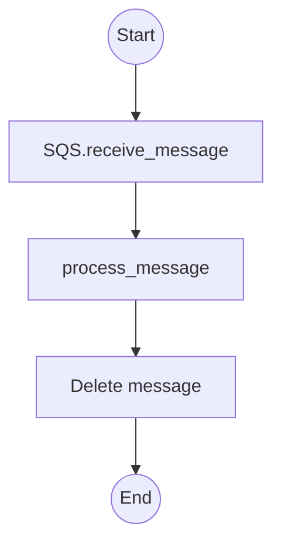
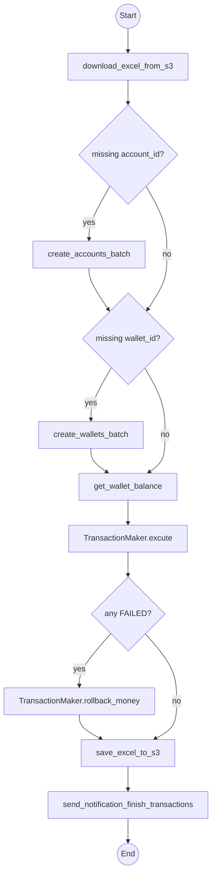

# Payment Batch Processor

This service listens to an AWS SQS queue for batch payment events. Each message provides the path to an Excel file stored in S3. The processor downloads the file, ensures that accounts and wallets exist for the listed identifiers, performs the transactions and uploads the results back to S3. When finished it notifies other services through additional SQS queues.

## Integrations
- **AWS S3**: downloads the uploaded Excel file and stores the resulting files in the bucket defined by `S3_BUCKET_NAME`.
- **AWS SQS**: reads events from `SQS_REQUEST_BATCH_TRANSACTION` and sends notifications through `SQS_RESQUEST_RELATION_ACCOUNTS` and `SQS_RESPONSE_BATCH_TRANSACTION`.
- **PostgreSQL Database**: wallets database connection via `PG_WALLETS_URL`.

## Environment variables
The processor is configured using environment variables:

| Variable | Description |
| --- | --- |
| `PG_WALLETS_URL` | Connection string for the wallets database. |
| `S3_BUCKET_NAME` | Bucket where Excel files are stored. |
| `SQS_REQUEST_BATCH_TRANSACTION` | Queue URL for incoming batch jobs. |
| `SQS_RESPONSE_BATCH_TRANSACTION` | Queue URL where the results are published. |
| `SQS_RESQUEST_RELATION_ACCOUNTS` | Queue URL used when new accounts are created. |
| `ID_ACCOUNT_BEU` | Account id used as treasury wallet for **beu** integration. |
| `ID_ACCOUNT_TIKIN` | Account id used as treasury wallet for **tikin** integration. |
| `AWS_REGION` | AWS region for boto3. Defaults to `us-east-1`. |

## Running locally
```bash
# Install dependencies
pip install -r requirements.txt

# Start processing the queue
python src/main.py
```

A Docker image can be built with:
```bash
docker build -t payment-batch-processor .
```

## Tests
Run the unit tests with:
```bash
python -m unittest discover -s tests
```

## Process overview

<details>
  <summary>process_queue</summary>


</details>

<details>
  <summary>process_message</summary>


</details>
